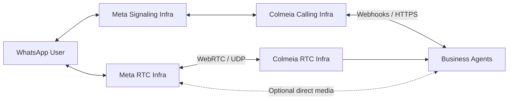
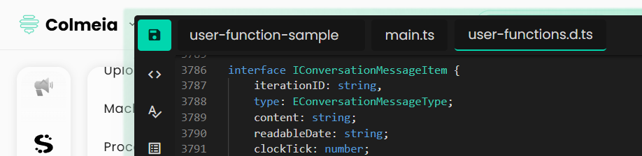

# Calling API Integration — Implementation Guide

Este documento é um guia de conceitos de como essa implementação foi integrada com a API de Calling usando um webhook e o fluxo de eventos de chamada. O foco é entender o contrato da API e do webhook pode ser implementado, com exemplos de payloads, headers e chamadas de teste.

## 1. Introdução

O objetivo deste guia é demonstrar como:
 - Apresentar uma visão geral da arquitetura
 - Receber eventos de chamadas via webhook HTTP.
 - Processar eventos `bot_req_call` e `connect`.
 - Enviar ou manipular eventos no browser (ou outro sistema) de forma segura.
 - Chamar a API de Calling para iniciar, aceitar ou encerrar chamadas.

## 2. Visão geral da arquitetura



## 3. Contrato do Webhook

O webhook é o ponto de entrada para eventos da API de Calling.
Você precisa configurar uma [Rota de conexão](https://docs.colmeia.cx/calling) com método `POST`, que será usada para enviar os eventos.

### Configuração desse exemplo:


#### 3.1 URL:
```http
/webhook/call-event
```

#### 3.2 Headers obrigatórios

`WEBHOOK_SECRET_HEADER` → valor configurado em `.env` (`WEBHOOK_SECRET`) 
e enviado pela Colmeia e definido por você na configuração da sua rota.

Exemplo:
```http
x-cbis-secret: foobaz
```

Alternativa futura: JWT (`Authorization`) comentada no `.env-sample`.

##### 3.3 Payload

Interface TypeScript:

```ts
interface ICallingIntegrationWebhookEvent {
    /**
     * Tipo do evento de chamada.
     * Ex: bot_req_call, connect, hangup, etc.
     */
    event: 'bot_req_call' | 'connect' | 'accept' | 'reject' | 'hangup';

    /**
     * Identificador único da chamada.
     */
    idCall: string;

    /**
     * Identificador do bot responsável pela chamada.
     */
    idBot: string;

    /**
     * Identificador da conversa associada à chamada.
     */
    idConversation: string;

    /**
     * Identificador de remoção do halt do bot
     * Útil para adiar a remoção do halt(fora do evento de hangup) ou a remoção em falhas.
     * 
     * Não é necessário enviar no evento de hangup.
     *
     * PRESENTE SOMENTE quando:
     * - event = bot_req_call
     * - event = connect - Quando o bot possui autorização e inicia a chamada.
     */
    idHaltCallback?: string;

    /**
     * Identificador de origem da chamada.
     * Pode representar número, usuário ou endpoint lógico.
     */
    from: string;

    /**
     * Destino da chamada.
     */
    to: string;

    /**
     * Sessão do bot.
     *
     * PRESENTE SOMENTE quando:
     * - event = bot_req_call
     * [Planned] - event = connect - Quando o bot possui autorização e inicia a chamada.
     */
    botSession?: {
        /**
         * Histórico da conversa associada à chamada.
         * Usado para contexto de decisão do bot.
         */
        conversation: IConversationMessageItem[];
        /**
         * Informações computadas em tempo real (RTF – Real-Time Fusion).
         */
        rtf: Record<string, string>;
    };

    /**
     * Descrição de sessão WebRTC.
     *
     * PRESENTE SOMENTE quando:
     * - event = connect
     * - event = accept
     *
     * Representa a sessão RTC ativa associada à chamada.
     */
    rtcSession?: RTCSessionDescriptionInit;
}
```


#### Todos as informações disponíveis em `IConversationMessageItem` você encontra em no arquivo de modelagem de UserFunctions:




Exemplo de `bot_req_call`:

```json
{
    "event": "bot_req_call",
    "idCall": "xyz",
    "idBot": "xyz",
    "idConversation": "xyz",
    "idHalt": "xyz",
    "from": "5582999999999",
    "to": "5582999999999",
    "botSession": {
        "vars": {
            "xyz": "foo",
        },
        "conversation": [
            {
                "interationID": "1231210913",
            }
        ]
    }
}
```

Exemplo de connect com SDP offer:

```json
{
    "event": "connect",
    "idCall": "xyz",
    "idBot": "xyz",
    "idConversation": "xyz",
    "from": "5582999999999",
    "to": "5582999999999",
    "rtcSession": {
        "type": "offer",
        "sdp": "v=0\r\no=- 123 2 IN IP4 127.0.0.1\r\n..."
    }
}
```

#### 3.4 Resposta esperada

O servidor deve responder rapidamente com **200 OK**.

Garantindo que a API de Calling não considere o evento falho.

---

### 4. Testando o Webhook com curl
#### 4.1 bot_req_call
```bash
curl -X POST http://localhost:5000/webhook/call-event \
  -H 'Content-Type: application/json' \
  -H 'x-cbis-secret: foobaz' \
  -d '{
    "event": "bot_req_call",
    "idCall": "xyz",
    "idBot": "xyz",
    "from": "5511999999999",
    "to": "5511888888888",
    "idConversation": "xyz"
  }'
````

#### 4.2 connect

```bash
curl -X POST http://localhost:5000/webhook/call-event \
  -H 'Content-Type: application/json' \
  -H 'x-cbis-secret: foobaz' \
  -d '{
    "event": "connect",
    "idCall": "xyz",
    "idBot": "xyz",
    "from": "5511999999999",
    "to": "5511888888888",
    "idConversation": "xyz",
    "session": {
        "type": "offer",
        "sdp": "v=0\r\no=- 123 2 IN IP4 127.0.0.1\r\n..."
    }
  }'
```
---

### 5. Chamando a API de Calling

Endpoint configurável via `.env`:

```ini
CALL_API_URL=https://dev-api.colmeia.cx/v1/rest/calling/event
CALL_API_TOKEN=seu_token_aqui
```

Exemplo de requisição para aceitar uma chamada:

```bash
curl -X POST $CALL_API_URL \
  -H "Content-Type: application/json" \
  -H "Authorization: $CALL_API_TOKEN" \
  -d '{
        "event": "accept",
        "idCall": "xyz",
        "idConversation": "xyz",
        "rtcSession": {
            "type": "answer",
            "sdp": "v=0\r\no=- 123 2 IN IP4 127.0.0.1\r\n..."
        }
    }'
```

Interface TypeScript:

```ts
interface ICallingIntegrationApiEvent {
    /**
     * Identificador único da chamada.
     */
    idCall: string;

    /**
     * Identificador da conversa.
     */
    idConversation: string;

    /**
     * Tipo do evento de chamada.
     */
    event: 'accept' | 'reject' | 'hangup';

    /**
     * Sessão WebRTC.
     *
     * Normalmente usada em:
     * - accept
     * - connect
     */
    rtcSession?: RTCSessionDescriptionInit;

    /**
     * Controle de pausa ou retomada de fluxo.
     *
     * idCallback é resolvido internamente.
     */
    haltResume?: Omit<ICallbackResumeFlowRequest, 'idCallback'>;
}
```

---

### 6. Fluxo completo de integração

1. API de Calling envia evento → webhook HTTP.
2. Server custom valida header → parse do body → envia 200 OK.
3. Server repassa evento para o browser via WebSocket (ou outro mecanismo).
4. Browser ou sistema cliente consome o evento e negocia WebRTC (SDP offer → answer).
5. Fluxo de voz é estabelecido.

```ini
[API Calling] 
     |
     v
[Webhook HTTP] --> valida header e body
     |
     v
[Serviço / Browser] --> RTCPeerConnection
```

---

### 7. Boas práticas de integração

 - Sempre validar header secreto do webhook.
 - Responder rapidamente **200 OK** para o evento.
 - Registrar logs para debug de SDP e eventos.